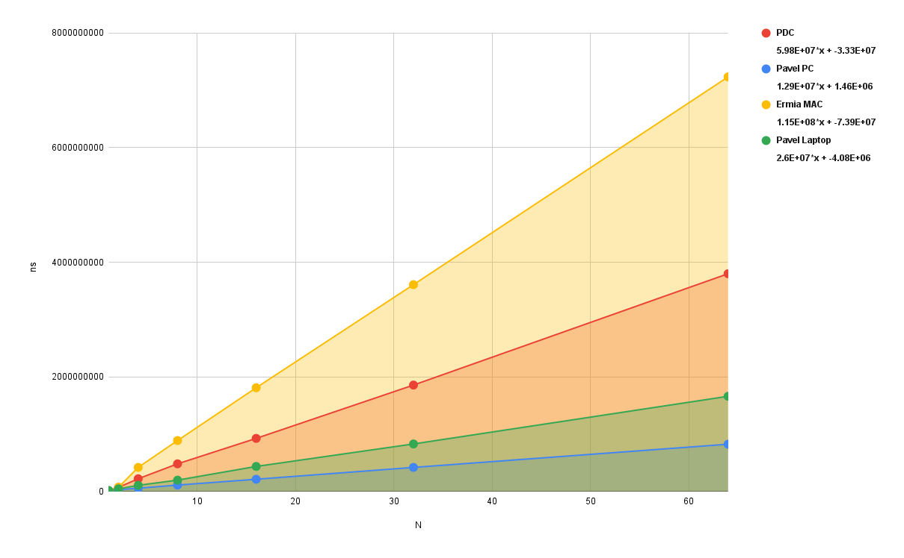

# Lab 1 - Basic Concurrency in Java

- Lab Group PE
- Ghaffari Ermia and Urvantsev Pavel

We would like to point out that skeleton code for Task 1b and Task 1c has been mixed up. Skeleton for Task 5b also has
the wrong class name.

## Task 1: Simple Synchronization

### Task 1a: Race conditions

Source files:

- `task1/MainA.java` (main file)

To compile and execute:

```
javac MainA.java
java MainA
```

#### What results do you expect?:

Since there is no synchronisation we expect the threads to override each other alot. Since the treads have similar speed
we can assume they will run somewhat interlaced so they should be able to count to at least a million, likely a bit
more.

### Task 1b: Synchronized keyword

Source files:

- `task1/MainB.java` (main file)

To compile and execute:

```
javac MainB.java
java MainB
```

#### What results do you expect?:

Depends on how the `synchronized` is implemented, if it is applied to a nonstatic method nothing will change from 1A as
each thread will have its own method and lock, making the lock useless. If the `synchronized` is applied either to a
static method or directly to a class object the desired effect is achieved and the methods are synchronized, meaning the
count will reach `4 000 000`.

### Task 1c: Synchronization performance

Source files:

- `task1/MainC.java` (main file)

To compile and execute:

```
javac MainC.java
java MainC <N>
```

Where `N` is number of threads to execute with.



In the figure above, we see how the execution time scaled with the number of threads. However, that is expected since
the workload also scales based on `N` since every thread need to add `1 000 000` to the shared counter.

It is interesting to see how some machines outpaced even the almighty PDC. The reason being that with the only work
being synchronized one has essentially made a sequential program with extra steps with the lock being the bottleneck.
Meaning that stations that are made for short burst workloads and high frequency processors like personal computers have
the edge over the PDC.

It is hard to talk about the overhead of synchronization as both congestion and workload increase with `N`, a better
benchmark would have been to compare `MainA` to `MainB`, then the overhead would be clear. Running a quick test on one
workstation showed a `35%` overhead.

This showcases the nature of concurrent programming as it not a free lunch and one needs to be writing code specifically
for concurrency as it can otherwise be bottlenecked. Concurrency also does not scale throughput 1:1 with `N` as there
overheads one needs to pay in order to resolve problems that arise with concurrency.

## Task 2: Guarded blocks using wait()/notify()
Source files:

- `task2/MainA.java` (main file)
- `task2/MainB.java` (main file)
- `task2/MainC.java` (main file)
- `task2/MainD.java` (main file)

To compile and execute:

```
javac MainX.java
java MainX
```

Running the microbenchmark with `100` warmups and `1000` samples gave the following result
`uB: 343.020	uC: 4880.043	uC/uB: 14.227` where `u` is the average delay for each method. As it can be seen method
`B` is about `14x` faster than method `C` with wait()/notify(). However, this does not mean that busy-waiting is always
better since `wait()` puts the thread in the _waiting_ mode where it releases all the locks and frees up the CPU core.

## Task 3: Producer-Consumer Buffer using Condition Variables

Source files:

- `task3/Main.java` (main file)
- `task3/Buffer.java`

To compile and execute:

```
javac Main.java Buffer.java
java Main
```

The buffer order of consumption is LIFO, boolean `closed` was used to implement the desired behaviour. Consumer in part
B is much slower that the producer, the consumer is able to remove only one value (on our machine) while the stack is
growing resulting in the remaing values be removed after the stack has already been filled and the producer has quit.

## Task 4: Counting Semaphore

Source files:

- `task4/Main.java` (main file)
- `task4/CountingSemaphore.java`

To compile and execute:

```
javac Main.java CountingSemaphore.java
java Main
```

### Runner

- Logs before entering `s_wait()`
- Logs start of `CS`
- Logs "works" for 2 sec
- Logs end of `CS`
- Logs before entering `signal()`

### Test 1

- Test `CS` overlap
- `n=1`
- `2` runners

### Test 2

- Test multiple `CS` overlap
- `n=3`
- `3` runners

### Test 3

- Test no resources case
- `n=0`
- `3` runners

### Test 4

- Test multiple waiting in queue
- `n=2`
- `5` runners

### Test 5

- Test reusability (similar to `Test 4`)
- `n=2`
- `5` runners
- `6` cycles

### Test 6

- Mock spurious wakeups using `Interupts`
- `n=1`
- `2` runners
- `3` cycles

### First Semaphore

```
    public synchronized void signal() {
        permits++;
        if (permits <= 0) {
            notify();
        }
    }
```

```
    public synchronized void s_wait() throws InterruptedException {
        permits--;
        if (permits < 0) {
            wait();
        }
    }
```

Stuck at `Test 4`, issue in `permits < 0`, even though a signal is sent the threads can't stop waiting. Failed to handle
queuing, solution add a flag to the condition.

### Go Semaphore

```
    public synchronized void signal() {
        go  = true;
        permits++;
        if (permits <= 0) {
            notify();
        }
    }
```

```
    public synchronized void s_wait() throws InterruptedException {
        permits--;
        if (permits < 0 && !go) {
            wait();
        }
        go = false;
    }
```

Problem at `Test 6`, `2` runners entered `CS` while `n=1`. Failed to handle spurious wakeups, simple fix change from
`if` to `while` also need to consume the `Interupt` as it is used to mock the spurious wakeup.

### Spurious Semaphore

```
    public synchronized void s_wait(){
        permits--;
        while (permits < 0 && !go) {
            try {
                wait();
            } catch (InterruptedException _) { //Mocking spurious wakeups, should not be part of real implementation 
                System.out.println("Spurious wakeup ignored");
            }
        }
        go = false;
    }
```

2 Issues noticed.

If 2 `signal()` are called together then only one runner would enter `CS` as the `go` boolean gets
overridden by runner `A` thus not letting runner `B` leave the loop. Solution change `go` to an integer.

If a real `Interrupt` occurs `s_wait()` does not exit gracefully and a permit is permanently consumed. Solution, a
runner
should return the permit if they are leaving the queue early.

### Final Semaphore

```
    public synchronized void signal() {
        go++;
        permits++;
        if (permits <= 0) {
            notify();
        }
    }
```

```
    public synchronized void s_wait() {
        permits--;
        while (permits < 0 && go == 0) {
            try {
                wait();
            } catch (InterruptedException _) {  //Mocking spurious wakeups, should not be part of real implementation
                System.out.println("Spurious wakeup ignored");
            } catch (Exception e) {             //Mocking interrupt, leave the queue gracefully
                permits++;
                throw new RuntimeException(e);
            }
        }
        go = go > 0 ? go-1 : 0;
    }
```

Deadlocks can occur only if the permits are initialized to `n < 1` indicating that there are no resources available, but
that is intended behaviour. The algorithm should be livelock free if `s_wait()` and `signal()` are used correctly, we
basically have a waiting and leaving queue, meaning the runners can't sabotage each other. However, the algorithm is not
starvation free as it only cares that there are up to `n` runners in the `CS` the rest is up to `notify()`
implementation and spurious wakeups.

## Task 5: Dining Philosophers

Source files:

- `task5/MainA.java` (main file)
- `task5/MainB.java` (main file)

To compile and execute:

```
javac MainX.java
java MainX
```

### Task 5a

The deadlock happens because of circular dependency, everyone picks up the left chopstick and succeeds, then tries to
acquire the right chopstick, all chopsticks are taken, nobody lets go, deadlock. It is harder to deadlock at higher `n`
as
one need to complete the longer circular dependency and randomness makes it harder.

### Task 5b

Java has the `jcmd` which is used to send diagnostic command requests to the JVM. It can give a thread print dump of a
currently running application, but for that it needs the `PID` which can be acquired using the `jps -l` command.

#### Commands:

```
 jps -l
 jcmd <PID> Thread.print
```

#### Output:

```
...
"Ph-0" #29 [114599] prio=5 os_prio=0 cpu=6,95ms elapsed=96,52s tid=0x00007f60381cb6b0 nid=114599 in Object.wait()  [0x00007f6004c2d000]
   java.lang.Thread.State: WAITING (on object monitor)
	at java.lang.Object.wait0(java.base@23.0.2/Native Method)
	- waiting on <0x000000062981a070> (a MainA$Chopstick)
	at java.lang.Object.wait(java.base@23.0.2/Object.java:378)
	at java.lang.Object.wait(java.base@23.0.2/Object.java:352)
	at MainA$Chopstick.pickUp(MainA.java:37)
	- locked <0x000000062981a070> (a MainA$Chopstick)
	at MainA$Philosopher.run(MainA.java:73)
	at java.lang.Thread.runWith(java.base@23.0.2/Thread.java:1588)
	at java.lang.Thread.run(java.base@23.0.2/Thread.java:1575)
...
```

There is no automatic deadlock message as it happens on logical level and not Java level. But here it can be seen that
PH-0 is waiting on monitor (lock), all other threads are also the same position meaning everyone is waiting and nobody
is doing work, it's a deadlock.

### Task 5c

Trivial solution that uses queue, it is deadlock and starvation free.
