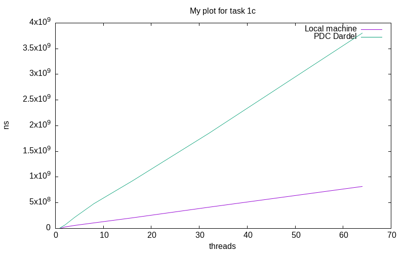

# Lab 1 - Basic Concurrency in Java

- Lab Group PE
- Ghaffari Ermia and Urvantsev Pavel

## Task 1: Simple Synchronization

### Task 1a: Race conditions

Source files:

- `task1/MainA.java` (main file)

To compile and execute:

```
javac MainA.java
java MainA
```

#### What results do you expect?:

Since there is no synchronisation we expect the reads to override each other alot. Since the treads have similar speed
we can assume they will run somewhat interlaced so they should be able to count to at least a million, likely a bit
more.

### Task 1b: Synchronized keyword

Source files:

- `task1/MainB.java` (main file)

To compile and execute:

```
javac MainB.java
java MainB
```

#### What results do you expect?:

Depends on how the `synchronized` is implemented, if it is applied to a nonstatic method nothing will change from 1A as
each thread will have its own method and lock, making the lock useless. If the `synchronized` is applied either to a
static method or directly to a class object the desired effect is achieved and the methods are synchronized, meaning the
count should reach 4 000 000.

### Task 1c: Synchronization performance

Source files:

- `task1/MainC.java` (main file)

To compile and execute:

```
javac MainC.java
java MainC <N>
```

Where `N` is number of threads to execute with.

In figure 1, we see how the execution time scaled with the number of threads.
...



## Task 2: Guarded blocks using wait()/notify()

## Task 3: Producer-Consumer Buffer using Condition Variables

## Task 4: Counting Semaphore

## Task 5: Dining Philosophers
